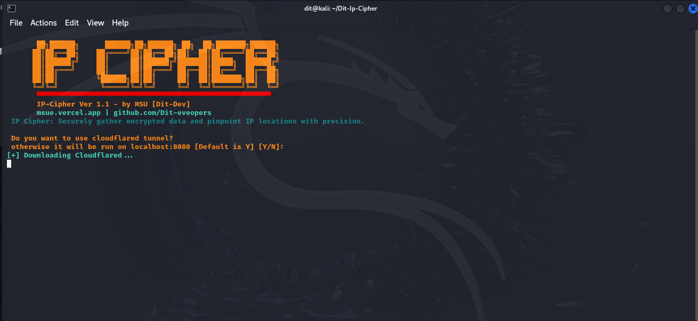

# IP-Cipher ☠

## What is IP-Cipher?

IP-Cipher is a tool that can capture following information about the target device:

- Longitude
- Latitude
- Device Model
- Operating System
- Number of CPU Cores
- Screen Resolution
- User Agent
- Public IP Address
- Browser Name
- ISP Information

## Features

The tool offers a wide range of features and functionality, including:

- Capture Exact GPS Location
- Automated Data Collection
- User-friendly Interface

## Tested On

- Kali Linux
- Windows (WSL)
- Termux
- Parrot Sec OS

## Installation and Requirements

This tool requires PHP for the webserver, and wget & unzip for downloading and extracting Cloudflare. First, run the following command on your terminal

## Installing:
### How to Install Dit-IP-Info-cli Tool in Termux
- `apt update && apt upgrade -y`
-` apt-get -y install php unzip git wget`
- `git clone https://github.com/Dit-Developers/Dit-Ip-Cipher`
- `cd Dit-Ip-Cipher `
- `bash ip-cipher.sh`

### How to Install Dit-IP-Info-cli Tool in Kali linux
- `sudo apt update && sudo apt upgrade -y`
- `sudo apt install git python3 python3-pip -y`
- ` git clone https://github.com/Dit-Developers/Dit-Ip-Cipher`
- `cd Dit-Ip-Cipher `
- `bash ip-cipher.sh`

## Developer Name:

The tool is developed by DIT-Developers.
